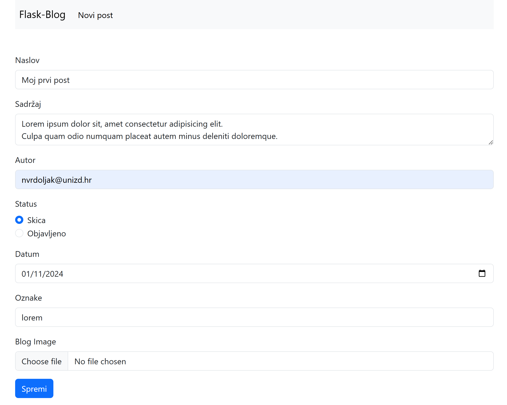
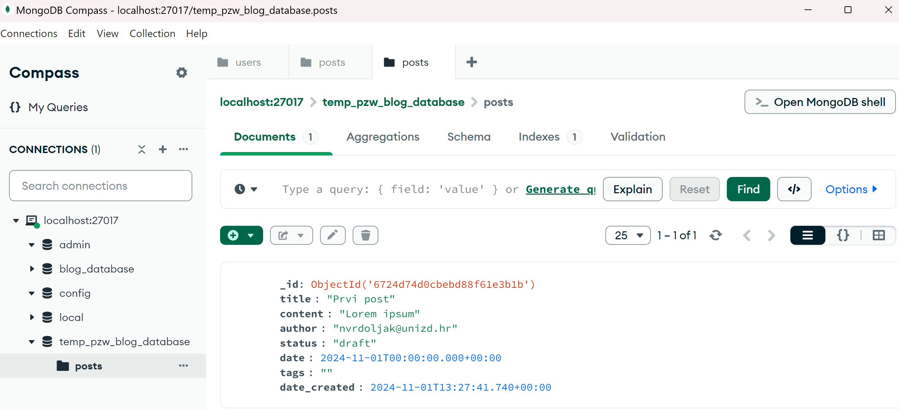
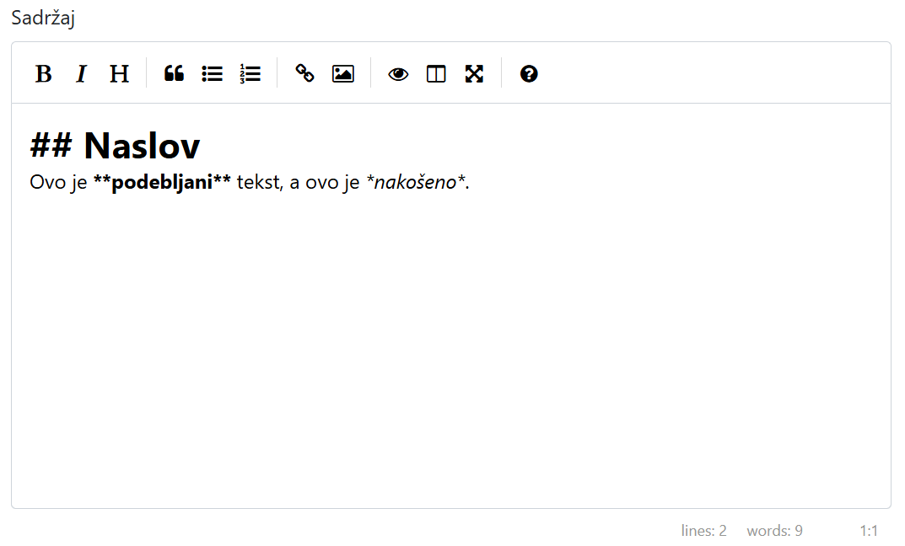
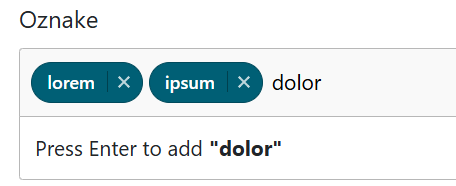

<link rel="stylesheet" href="assets/css/custom.css">

[Naslovna stranica](README.md) | [Prethodno poglavlje: Flask i web obrasci](chapter1.md)| [Slijedeće poglavlje: Autentikacija](chapter3.md)


# Uvod u baze podataka i njihovu primjenu u aplikacijama
U ovom poglavlju specificirat ćemo zahtjeve naše aplikacije za upravljanje blog člancima, te započeti s njenom implementacijom. No prije toga ćemo ukratko predstaviti koncept baze podataka, koju ćemo koristiti za spremanje članaka i ostalih entiteta naše aplikacije. 

**Baze podataka** su ključne za pohranjivanje podataka koje aplikacija koristi i obrađuje, poput korisničkih informacija, sadržaja i drugih vrsta podataka. One omogućuju trajno spremanje podataka, pristup njima, pretragu, ažuriranje i brisanje na strukturiran način. Umjesto pohranjivanja podataka u privremenu memoriju ili datoteke, baze podataka omogućuju rad s velikim količinama podataka na učinkovit i siguran način, čuvajući integritet podataka.

U aplikacijama poput bloga (koju ćemo mi raditi), baza podataka omogućuje spremanje članaka, komentara, korisničkih informacija i drugih elemenata potrebnih za funkcionalnost bloga. Korištenjem baze podataka, možemo jednostavno dohvatiti, filtrirati i prikazati članke.

## MongoDB – NoSQL baza podataka
**MongoDB** je NoSQL baza podataka, što znači da podaci nisu pohranjeni u tabličnom obliku kao u klasičnim relacijskim bazama podataka (npr. MySQL). Umjesto toga, MongoDB koristi JSON-slične dokumente (u BSON formatu) za pohranu podataka, što omogućava fleksibilnije modeliranje podataka. Ovaj pristup je prikladan za aplikacije u kojima se podaci često mijenjaju ili imaju različite strukture.

MongoDB je popularan zbog:
* Fleksibilnosti – Dokumenti u bazi mogu imati različite strukture.
* Skalabilnosti – Podržava horizontalno skaliranje.
* Jednostavne integracije – MongoDB se lako integrira s različitim programskim jezicima, uključujući Python, što ga čini idealnim za Flask aplikacije.
U našoj blog aplikaciji, svaki blog članak možemo pohraniti kao dokument s ključevima kao što su naslov, sadržaj, autor i datum.

## Instalacija MongoDB-a na lokalno računalo
Da biste koristili MongoDB lokalno, slijedite ove korake:

**Preuzimanje**: Idite na službenu MongoDB stranicu za preuzimanje i preuzmite MongoDB Community Server za vaš operativni sustav:
* [https://www.mongodb.com/try/download/community](https://www.mongodb.com/try/download/community) (MongoDB Community Server - s njim ide i Compass)
* Opcionalno:
    * [https://www.mongodb.com/try/download/compass](https://www.mongodb.com/try/download/compass) (MongoDB Compass)
    * [https://www.mongodb.com/try/download/shell](https://www.mongodb.com/try/download/shell) (MongoDB Shell)


### Instalacija:

* **Windows**: Pokrenite instalacijski program (.msi datoteku) i slijedite upute. Preporučuje se uključivanje opcije *Install MongoDB as a Service* kako bi MongoDB bio automatski pokrenut prilikom podizanja sustava.
* **macOS**: Koristite Homebrew za instalaciju:
```bash
brew tap mongodb/brew
brew install mongodb-community
```
* **Linux**: Instalacija varira ovisno o distribuciji, ali obično uključuje dodavanje MongoDB repozitorija, ažuriranje popisa paketa, i instaliranje pomoću paketa mongodb-org.

### Pokretanje MongoDB-a:
* Na Windowsu, MongoDB servis će se automatski pokrenuti (ako ste ga uključili prilikom instalacije).
* Na macOS i Linux sustavima možete pokrenuti MongoDB naredbom:
```bash
mongod --dbpath /putanja/do/vašeg/db/foldera
```
* Preporučljivo je stvoriti poseban direktorij gdje će MongoDB pohranjivati podatke.
* Povezivanje s MongoDB-om: Nakon instalacije, MongoDB će raditi na localhostu, portu **27017**. Koristit ćemo ga našoj u Flask aplikaciji pomoću Pythona i biblioteke **pymongo**.

U sljedećem koraku, integrirat ćemo MongoDB s Flask aplikacijom za spremanje i dohvaćanje blog članaka.

## Specifikacija Blog aplikacije

Aplikacija će koristiti Flask, Bootstrap-Flask za stilizaciju, Flask-WTF za obradu formi i MongoDB kao bazu podataka za pohranu podataka o člancima. U ovom poglavlju naš cilj je stvoriti jednostavnu, ali funkcionalnu aplikaciju koja omogućava korisnicima kreiranje, uređivanje, brisanje i pregled blog članaka. Dodatno ćemo na kraju uključiti i neke komponente za učinkovitije uređivanje sadržaja i oznaka.

### Glavne funkcionalnosti aplikacije:
* **Lista članaka**: Korisnici će moći pregledavati sve blog članke na jednoj stranici. Svaki članak će sadržavati naslov, sažetak i osnovne informacije poput autora i datuma. Prikazivat ćemo samo članke sa statusom "objavljen".
* **Pregled pojedinačnih članaka**: Klikom na članak, korisnici će biti preusmjereni na stranicu koja prikazuje puni sadržaj članka, uključujući slike i tagove.
* **Kreiranje članaka**: Aplikacija će omogućiti autorima da kreiraju nove članke putem forme. Ova forma će uključivati potrebna polja kao što su naslov, sadržaj, autor, datum, oznake (tagove) i slike.
* **Uređivanje članaka**: Autori će moći uređivati postojeće članke. To će uključivati ponovno prikazivanje forme s prethodno unesenim podacima, omogućujući autorima da izvrše izmjene.
* **Brisanje članaka**: Korisnici će moći brisati članke, čime će se trajno ukloniti podaci iz baze. Autor mora povrditi brisanje u modalnom prozoru.

### Struktura modela podataka
Svaki blog članak će imati sljedeće atribute:
* Naslov (title): Kratak opis članka koji će biti prikazan na listi članaka.
* Sadržaj (content): Glavni tekst članka.
* Autor (author): Ime osobe koja je napisala članak.
* Datum (date): Datum kada je članak kreiran.
* Tagovi (tags): Kategorije ili ključne riječi povezane s člankom, omogućujući korisnicima lakše pretraživanje.
* Slika (image): Veza prema slici koja će biti prikazana u članku. Slike ćemo također spremati u MongoDB bazu.

## Implementacija Blog aplikacije

Da bismo započeli s implementacijom aplikacije za upravljanje blogom, prvo ćemo kreirati klasu **BlogPostForm** koja će koristiti **Flask-WTF** za obradu formi, zatim ćemo implementirati rutu za kreiranje novog posta i pohraniti članak u MongoDB. Evo koraka koje trebate slijediti:

### Instalacija pymongo
Prije nego što počnemo raditi s MongoDB-om u našoj Flask aplikaciji, trebamo instalirati biblioteku **pymongo**, koja omogućava povezivanje Flask aplikacije s MongoDB-om. Za instalaciju pokrenite naredbu u terminalu:
```bash
pip install pymongo
```
Ova biblioteka omogućit će nam rad s kolekcijama i dokumentima unutar MongoDB baze podataka.

### Postavljanje koda za spajanje na bazu podataka
Dodajmo slijedeći kod na vrh aplikacije ispod instanciranja ```app``` objekta:
```python
client = MongoClient('mongodb://localhost:27017/')
db = client['pzw_blog_database']
posts_collection = db['posts']
```

**Pojašnjenje koda:**

```python
client = MongoClient('mongodb://localhost:27017/')
```

Ova linija inicijalizira MongoDB klijenta koristeći ```MongoClient``` iz ```pymongo``` biblioteke. MongoClient objekt se povezuje s MongoDB instancom koja radi na ```localhost``` (vaše lokalno računalo) i sluša na standardnom MongoDB portu ```27017```. Ova adresa (```mongodb://localhost:27017/```) je standardna adresa za lokalni pristup MongoDB-u, koja omogućuje aplikaciji povezivanje s bazom podataka.

```python
db = client['pzw_blog_database']
```

Ova linija pristupa bazi podataka unutar MongoDB-a s imenom ```pzw_blog_database```. Ako baza podataka s ovim imenom ne postoji, MongoDB će je automatski kreirati kada dodate podatke u nju. Objekt ```db``` omogućava aplikaciji rad s bazom podataka, uključujući stvaranje kolekcija (poput tablica u SQL bazama podataka) i obavljanje upita.

```python
posts_collection = db['posts']
```

Ovdje definiramo kolekciju unutar baze podataka nazvanu ```posts```. Kolekcija je slična tablici u SQL bazama podataka i koristi se za pohranu više dokumenata (redaka) s podacima o blog člancima. MongoDB koristi **JSON**-sličan format pod nazivom **BSON** (Binary JSON) za pohranu podataka, što ga čini prikladnim za pohranu nestrukturiranih podataka poput blog članaka.

Dakle, ovaj kod omogućuje aplikaciji da:
* Pristupi MongoDB serveru na lokalnom računalu.
* Radi s bazom podataka ```pzw_blog_database```.
* Pristupi kolekciji ```posts```, gdje će se pohranjivati i preuzimati podaci o člancima bloga.


### Kreiranje BlogPostForm klase

Slijedeći korak je definiranje obrasca (forme) koja će sadržavati potrebna polja za blog članak. Klasa će izgledati ovako:

```python
from wtforms import StringField, TextAreaField, DateField, FileField
from wtforms.validators import DataRequired, Length
from flask_wtf.file import FileAllowed
from datetime import datetime, timezone

class BlogPostForm(FlaskForm):
    title = StringField('Naslov', validators=[DataRequired(), Length(min=5, max=100)])
    content = TextAreaField('Sadržaj')
    author = StringField('Autor', validators=[DataRequired()])
    date = DateField('Datum', default=datetime.today)
    status = RadioField('Status', choices=[('draft', 'Skica'), ('published', 'Objavljeno')], default='draft')
    tags = StringField('Oznake')
    image = FileField('Blog Image', validators=[FileAllowed(['jpg', 'png', 'jpeg'], 'Samo slike!')])
    submit = SubmitField('Spremi')
```
Ova klasa definirana je na način sličan klasi NameForm iz prethodnog poglavlja, i predstavlja model obrasca našeg blog članka. No pgledajmo koje nove značajke susrećemo ovdje:
* Polja title i author su **StringField** koja pohranjuju naslov i ime autora. Koriste validator DataRequired() kako bi osigurao da su polja popunjena.
* **Length(min=5, max=100)**: Provjerava da je uneseni tekst između 5 i 100 znakova.
* Polje content je **TextAreaField**, namijenjeno za unos duljeg teksta (sadržaja blog posta). Nema dodanih validatora, pa je unos u ovo polje opcionalan.
    * Kasnije ćemo dodati mogućnost unosa sadržaja u Markdown (MD) formatu.
* Polje date je **DateField** koje koristi trenutni datum kao zadanu vrijednost putem datetime.today.
* Polje status je **RadioField**, koje omogućuje korisniku da odabere između dvije opcije: draft (Skica) i published (Objavljeno). Zadana vrijednost je draft, što znači da će svaki članak biti spremljen kao skica osim ako korisnik ne odabere objavljivanje.
* Polje tags je StringField za unos oznaka povezanih s člankom. Oznake se mogu koristiti za kategorizaciju ili pretraživanje sadržaja, a unos je opcionalan. 
* Polje image je **FileField** koje omogućuje korisniku dodavanje slike uz članak. Koristi validator FileAllowed(['jpg', 'png', 'jpeg'], 'Samo slike!') koji dopušta samo određene tipove datoteka (JPEG i PNG slike). Ako korisnik pokuša dodati datoteku drugog tipa, prikazat će se poruka "Samo slike!".
    * Podršku za dodavanje slika ćemo dodati kasnije.


### Ruta za kreiranje novog posta
Sada ćemo definirati rutu koja će omogućiti korisnicima da kreiraju novi blog članak. Ova ruta će obrađivati GET zahtjeve za prikaz forme i POST zahtjeve za pohranu podataka u MongoDB.
```python
@app.route('/blog/create', methods=["get", "post"])
def post_create():
    form = BlogPostForm()
    if form.validate_on_submit():
        post = {
            'title': form.title.data,
            'content': form.content.data,
            'author': form.author.data,
            'status': form.status.data,
            'date': datetime.combine(form.date.data, datetime.min.time()),
            'tags': form.tags.data,
            'date_created': datetime.utcnow()
        }
        posts_collection.insert_one(post)
        flash('Članak je uspješno upisan.', 'success')
        return redirect(url_for('index'))
    return render_template('blog_edit.html', form=form)
```

Ova ruta izgleda slično onoj iz prethodnog poglavlja. Nakon validacije, svi uneseni podaci iz obrasca dohvaćaju se pomoću ```.data``` atributa i pohranjuju u novi rječnik ```post```. 

Dalje se koristi ```insert_one()``` metoda iz pymongo biblioteke kako bi se novi članak pohranio u MongoDB kolekciju pod nazivom ```posts_collection```. Svaki put kad korisnik pošalje novu obrazac, stvara se novi dokument u bazi. Metoda ```flash()``` prikazuje poruku korisniku nakon uspješnog unosa, te se preusmjeravamo na rutu ```index()```.

Ako obrazac nije poslan ili ako ima pogreške u unosu, prikazuje se ```blog_edit.html``` predložak s obrascem kako bi korisnik mogao vidjeti podatke u obrascu i ispraviti eventualne greške. Stoga kreirajmo taj novi predložak.


### Prikaz forme za kreiranje posta
Kreirajte novi predložak ```blog_edit.html``` u *templates* mapi i u njega umetnite slijedeći, vrlo jednostavan kod:
```html



Uređivanje Blog posta



{{ render_form(form) }}


```

### Link za kreiranje posta i navigacijska traka
Dodat ćemo link koji vodi na stranicu s formom za kreiranje novog posta. Za tu svrhu dodat ćemo navigacijsku traku s linkom.
Kako bismo dodali navigacijsku traku koristeći Bootstrap u osnovni predložak (base.html), možemo koristiti ugrađene Bootstrap klase. Ova navigacijska traka imat će naslov Flask-Blog i jednu navigacijsku vezu koja vodi na stranicu za kreiranje članka.
Otvorite base.html predložak, te dodajte Bootstrap navigacijsku traku u tijelo stranice pomoću sljedećeg HTML koda, odmah ispod ```<div class="container">``` (uklonite ```mt-5``` ako je prisutan):
```html
    
    
    <nav class="navbar navbar-expand-lg navbar-light bg-light sticky-top mb-5">
        <a class="navbar-brand ms-2" href="{{url_for('index') }}">Flask-Blog</a>
        <button class="navbar-toggler" type="button" data-bs-toggle="collapse" data-bs-target="#navbarNav"
            aria-controls="navbarNav" aria-expanded="false" aria-label="Toggle navigation">
            <span class="navbar-toggler-icon"></span>
        </button>

        <div class="collapse navbar-collapse mt-1" id="navbarNav">
            <ul class="navbar-nav">
                {{ render_nav_item('post_create', 'Novi članak', _use_li = True) }}
            </ul>
        </div>
    </nav>
    
```

**Objašnjenje koda**

* ```navbar navbar-expand-lg navbar-light bg-light```: Ove Bootstrap klase koriste se za stiliziranje navigacijske trake. 
* ```navbar-expand-lg``` osigurava da se traka proširuje na većim ekranima, dok bg-light postavlja svijetlu pozadinu.
* ```navbar-brand```: Ovaj element prikazuje naziv aplikacije, tj. Flask-Blog.
* ```navbar-toggler```: Dodaje ikonu za preklapanje koja omogućuje skrivanje/otvaranje navigacijskog izbornika na manjim zaslonima.
* ```nav-link```: Poveznica unutar navigacijske trake koja vodi na stranicu za kreiranje novog posta pomoću URL-a rute create_post.

Ovaj dizajn navigacijske trake sada omogućava korisnicima pristup glavnoj stranici i stranici za kreiranje posta, a u daljnjim koracima ćemo dodati i dodatne veze prema potrebi.

**Testiranje**
Ako ste sve uspješno odradili, nova verzija aplikacije će imati navigacijsku traku s linkom "Novi članak". Kliknite ga i pojavit će se stranica s obrascem za unos članka. Popunite obrazac, i kliknite gumb "Spremi". Vrijednosti obrasca bit će spremljeni u MongoDB bazu.



Ovim koracima omogućili smo unos podataka za novi blog članak putem forme i pohranu tih podataka u MongoDB unutar kolekcije posts_collection. U daljnjim koracima proširit ćemo funkcionalnost kako bismo omogućili prikaz, uređivanje i brisanje blog članaka.

### Provjera sadržaja kolekcije članaka u bazi

Da bismo vidjeli spremljeni blog članak u MongoDB koristimo **MongoDB Compass**. Slijedite ove korake:

1. Pokretanje MongoDB Compass: Otvorite MongoDB Compass aplikaciju na svom računalu. MongoDB Compass omogućava vizualno istraživanje i upravljanje podacima pohranjenim u MongoDB bazi.

2. Povezivanje s MongoDB: Na početnom zaslonu MongoDB Compass-a upišite URL za povezivanje sa svojom lokalnom bazom podataka. Za lokalno postavljen MongoDB, URL obično izgleda ovako:
    * ```mongodb://localhost:27017/```
    * Kliknite na "Connect" kako biste se povezali s MongoDB-om.

3. Pristupanje bazi i kolekciji:
    * Nakon uspješnog povezivanja, u lijevom izborniku vidjet ćete popis baza podataka. Pronađite svoju bazu, u ovom slučaju, ```pzw_blog_database```.
    * Kliknite na bazu kako biste otvorili popis kolekcija, zatim odaberite kolekciju ```posts```.
4. Pregled članaka:
    * Unutar kolekcije "posts" možete vidjeti sve spremljene dokumente. Ovdje će biti prikazani svi blog postovi koje ste pohranili, svaki kao pojedinačan dokument.
    * Prvi blog članak koji ste unijeli putem aplikacije trebao bi biti vidljiv ovdje. Moći ćete pregledati polja kao što su ```title```, ```content```, ```author```, ```date```, i ```tags```.
5. Pregledavanje i uređivanje:
    * Možete kliknuti na svaki dokument kako biste vidjeli detalje. Također, MongoDB Compass nudi opcije za uređivanje, brisanje ili dodavanje novih dokumenata ako želite pokazati dodatne funkcionalnosti studentima.
6. Dodatne Opcije:
    * MongoDB Compass nudi opcije poput pretraživanja, filtriranja i sortiranja dokumenata, što može pomoći kod demonstracija složenijih upita i prikaza podataka.




### Mongo Shell
Mongo Shell omogućava jednostavne pretrage i manipulacije direktno iz komandne linije.
Osim u Mongo Compass, spremljene podatke iz MongoDB baze možmo pregledati i koristeći **Mongo Shell**. Mongo Shell omogućava jednostavne pretrage i manipulacije direktno iz komandne linije. Slijedite ove korake:

1. Pokrenite Mongo Shell: U terminalu pokrenite Mongo Shell pomoću komande ```mongo``` ili ```mongosh``` (ovisno o verziji).
2. Povezivanje s Bazom Podataka: Ako se vaša MongoDB baza nalazi na lokalnom računalu s defaultnim postavkama, možete se direktno povezati. Ako trebate specificirati bazu, koristite:
```bash
use pzw_blog_database
```
3. Pregled članaka u kolekciji: Da biste dohvatili sve blog članke spremljene u kolekciji posts, upišite:
```js
db.posts.find()
```

**Primjer:**

```bash
PS> mongosh
Connecting to:          mongodb://127.0.0.1:27017/
test> use pzw_blog_database
switched to db pzw_blog_database
pzw_blog_database> db.posts.find()
[
  {
    _id: ObjectId('6724d74d0cbebd88f61e3b1b'),
    title: 'Prvi post',
    content: 'Lorem ipsum',
    author: 'nvrdoljak@unizd.hr',
    status: 'draft',
    date: ISODate('2024-11-01T00:00:00.000Z'),
    tags: '',
    date_created: ISODate('2024-11-01T13:27:41.740Z')
  }
]
```

Sami odaberite koju aplikaciju ćete koristiti za rad s MongoDB-om: Compass ili Shell.

### Prikaz članaka na glavnoj stranici

Za prikazivanje blog članaka s statusom "published" u početnoj (index) ruti, prvo ćemo dohvatiti sve članke iz MongoDB-a koji imaju status "published". Zatim ćemo ih prikazati u izmijenjenom predlošku.

Prvo, trebamo prilagoditi rutu i dohvatiti podatke iz baze podataka. Zatim ćemo izmijeniti predložak za prikaz tih podataka.

**Ažuriranje rute**

Ažurirajmo index rutu da dohvaća samo objavljene članke iz kolekcije ```posts_collection```. Izbrišimo što smo u njoj do sad imali i stavimo:
```python
@app.route("/", methods=["GET", "POST"])
def index():
    published_posts = posts_collection.find({"status": "published"}).sort('date', -1)
    return render_template('index.html', posts = published_posts)
```
Ovdje koristimo ```posts_collection.find({"status": "published"}).sort('date', -1)``` kako bismo dohvatili samo članke s statusom "published". ```sort('date', -1)```  metoda sortira članke prema polju ```date```. Argument -1 označava opadajući redoslijed (najnoviji postovi se nalaze na vrhu). Ako želite rastući redoslijed, koristit ćete 1 umjesto -1.

Promijenimo i index.html predložak. U njemu ćemo iterirat kroz listu članaka i prikazati podatke poput naslova, autora, datuma, oznaka i sadržaja. Poveznicu na detalje posta (koju ćemo implementirati kasnije) postavit ćemo na naslovu.

```html


Početna stranica

	{{ super() }}
	<style>
	</style>



<h1 class="mb-4">Flask-Blog</h1>

<ul class="col-8 list-unstyled">
    
    <li>
        <h2><a href="#" class="text-dark text-decoration-none">{{ post.title }}</a></h2>
        <p><strong>Autor:</strong> {{ post.author }} - {{ post.date.strftime('%d.%m.%Y') }}</p>
        <p class="mt-2">
            <span class="badge bg-primary">{{ tag }}</span>
        </p>
        <p>{{ post['content'][:150] }}</p>
        <hr>
    </li>
        
</ul>



```

**Objašnjenje dijelova koda**
* Datum formatiramo u ```d.M.YYYY``` oblik pomoću ```strftime``` funkcije.
* Prikazujemo samo prvih 150 znakova sadržaja posta.
* Razdvajamo oznake po zarezima ```split(',')``` funkcijom, a ```badge bg-primary``` daje oznakama izgled male značke s plavom bojom.

### Prikaz pojedinačnog posta
Implementirat ćemo rutu ```/blog/<post_id>``` koja će prikazivati detalje posta, te omogućiti uređivanje i brisanje članaka.

Prvo ćemo definirati rutu koja će dohvatiti članak pomoću ```post_id```, a zatim prikazati njegov sadržaj u novom predlošku ```blog_edit.html```.

```python
from bson.objectid import ObjectId

@app.route('/blog/<post_id>')
def post_view(post_id):
    post = posts_collection.find_one({'_id': ObjectId(post_id)})

    if not post:
        flash("Članak nije pronađen!", "danger")
        return redirect(url_for('index'))

    return render_template('blog_view.html', post=post)
```

Kreirajmo i novi predložak ```blog_view.html``` koji će prikazati post:
```html


{{post.title}}

	{{ super() }}
	<style>
	</style>



    <div class="col-8">
        <h2>{{post.title}}</h2>
        <h5 class="mt-5">{{post.author}} - {{post.date.strftime('%d.%m.%Y')}}</h5>
        <p class="mt-2">
            <span class="badge bg-primary">{{ tag }}</span>
        </p>
        <p class="mt-5">{{post.content }}</p>
        <div>
            <a href="#" type="button" class="btn btn-primary btn-sm">Uredi</a>
            <a href="#" type="button" class="btn btn-danger btn-sm">Briši</a>
        </div>
    </div>


```

Na kraju promijenimo u ```index.html``` link na detalje:
```html
<h2><a href="{{ url_for('view_post', post_id=post['_id']) }}" class="text-dark text-decoration-none">{{ post.title }}</a></h2>
```


Ako sad kliknemo na naslov posta na glavnom stranici, otvorit će se stranica samo s tim člankom. 

Na dnu posta smo dodali i dva gumba koje ćemo koristiti za uređivanje i brisanje posta, pa krenimo i s tim dijelom.

### Uređivanje posta
Da bismo urediti sadržaj posta kreirat ćemo novu rutu, a na gumb "Uredi" postavit ćemo link na rutu.
Izmijenimo gumb "Uredi":
```html
<a href="{{ url_for('post_edit', post_id=post['_id']) }}" type="button" class="btn btn-primary btn-sm">Uredi</a>
```

Dodajmo novu rutu:
```python
@app.route('/blog/edit/<post_id>', methods=["get", "post"])
def post_edit(post_id):
    form = BlogPostForm()
    post = posts_collection.find_one({"_id": ObjectId(post_id)})

    if request.method == 'GET':
        form.title.data = post['title']
        form.content.data = post['content']
        form.author.data = post['author']
        form.date.data = post['date']
        form.tags.data = post['tags']
        form.status.data = post['status']
    elif form.validate_on_submit():
        posts_collection.update_one(
            {"_id": ObjectId(post_id)},
            {"$set": {
                'title': form.title.data,
                'content': form.content.data,
                'date': datetime.combine(form.date.data, datetime.min.time()),
                'tags': form.tags.data,
                'status': form.status.data,
                'date_updated': datetime.utcnow()
            }}
        )
        flash('Članak je uspješno ažuriran.', 'success')
        return redirect(url_for('post_view', post_id = post_id))
    else:
        flash('Dogodila se greška!', category='warning')
    return render_template('blog_edit.html', form=form)
```
**Objašnjenje koda**

Nova  ```post_edit``` ruta radi na način sličan kako smo u prehodnom poglavlju pojasnili rad s formama.
* Kad korisnik klikne "Uredi" GET metoda se poziva, s ID-om posta. Iz baze dohvaćamo podatke i popunjavamo BlogPostForm objekt s vrijednostima iz baze, te prikazujemo isti predložak ```blog_edit.html``` kao i kod unosa novog posta.
* Kad korisnik izmijeni sadržaj posta i klikne "Spremi" gumb, poziva se POST metoda, te se provjerava validnost vrijesnoti forme ```form.validate_on_submit()``` metodom. Ukoliko je sve u redu, ažurirat ćemo vrijesnot zapisa u bazi pomoću ```posts_collection.update_one``` metode, salje se poruka o uspješno izvršenoj radnji, te se ponovo prikazujemo članak.
* U slučaju greške (npr. promijenimo CSRF token i sl.), prikazat će se poruka o grešci, te će korisnik biti preusmjeren na ponovno uređenje forme.

### Brisanje posta
Sljedeći korak je brisanje posta. I u ovom slučaju ćemo kreirati novu rutu, no u slučaju klika na gumb "Briši" pitat ćemo korisnika da li je siguran da želi pobrisati članak. 

Koristit čemo Bootstrap komponentu [Modal](https://getbootstrap.com/docs/5.3/components/modal/) za prikaz dijaloga za potvrdu. *Modal* nam omogućuje da prikažemo prozor s gumbima za potvrdu ili otkazivanje određene radnje. Stoga promijenimo najprije "Briši" gumb u ```blog_view.html```:

```html
            <button type="button" class="btn btn-danger btn-sm" data-bs-toggle="modal" data-bs-target="#deleteModal"
                data-postid="{{ post['_id'] }}">
                Briši
            </button>
```
Ukratko, ovdje koristimo ```data-bs-toggle``` za povezivanje s modalom prozorom (```#deleteModal```) i ```data-postid``` za prosljeđivanje ID-a posta JavaScript kod, kojeg ćemo proslijediti kao članak za brisanje.

Nadalje za korištenje *Modal* komponente, treba nam dodatak HTML i JavaScript kod. Dodajmo ga na kraj ```blog_view.html``` predloška:

```html
<div class="modal fade" id="deleteModal" tabindex="-1" aria-labelledby="deleteModalLabel" aria-hidden="true">
    <div class="modal-dialog">
        <div class="modal-content">
            <div class="modal-header">
                <h5 class="modal-title" id="deleteModalLabel">Potvrda brisanja</h5>
                <button type="button" class="btn-close" data-bs-dismiss="modal" aria-label="Close"></button>
            </div>
            <div class="modal-body">
                Da li ste sigurni da želite obrisati ovaj post?
            </div>
            <div class="modal-footer">
                <button type="button" class="btn btn-secondary" data-bs-dismiss="modal">Odustani</button>
                <form id="deleteForm" method="POST" action="" class="d-inline">
                    <button type="submit" class="btn btn-danger">Briši</button>
                </form>
            </div>
        </div>
    </div>
</div>

<script>
    const deleteModal = document.getElementById('deleteModal');
    deleteModal.addEventListener('show.bs.modal', function (event) {
        const button = event.relatedTarget;
        const postId = button.getAttribute('data-postid');
        const deleteForm = document.getElementById('deleteForm');
        deleteForm.action = `/blog/delete/${postId}`;
    });
</script>
```
Ovaj kod prikazuje Bootstrap *Modal* za potvrdu brisanja posta. Kada se modal otvori, JavaScript kod dohvaća jedinstveni ID posta (pomoću atributa data-postid iz gumba) i ažurira URL za deleteForm obrazac. Na taj način se šalje ispravni ID posta za brisanje kada potvrdimo brisanje.

Još moramo dodati i Flask rutu za brisanje:
```python
@app.route('/blog/delete/<post_id>', methods=['POST'])
def delete_post(post_id):
    posts_collection.delete_one({"_id": ObjectId(post_id)})
    flash('Članak je uspješno obrisan.', 'success')
    return redirect(url_for('index'))
```
Ova ruta dohvaća ID posta iz URL-a, briše odgovarajući zapis iz ```posts_collection``` u MongoDB-u, prikazuje poruku o uspješnom brisanju, te preusmjerava na glavnu stranicu.

Slijede još tri značajke kojimo želimo u našu aplikaciju:
* dodavanje i prikaz slike posta
* formatiranje sadržaja posta u Markdown formatu
* lakše dodavanje tagova (oznaka) posta

### Podrška za slike u članku
Za spremanje slika u člancima, koristit ćemo također MongoDB. U MongoDB-u, slike se pohranjuju koristeći sustav nazvan **GridFS**. Umjesto da se slika sprema direktno u jedan dokument (što bi moglo premašiti ograničenje MongoDB-a od 16 MB po dokumentu), GridFS omogućava da se velike binarne datoteke, poput slika, pohranjuju u manjim dijelovima kroz više dokumenata.
Evo kako to funkcionira u našem scenariju:
* **Razbijanje podataka na dijelove:** Kada se slika učita pomoću GridFS-a, podijeli se na manje dijelove, obično od 255 KB. Ti se dijelovi pohranjuju kao zasebni dokumenti unutar kolekcije ```fs.chunks``` u MongoDB bazi.
* **Metapodaci u fs.files:** Svaka datoteka pohranjena pomoću GridFS-a ima zapis metapodataka u kolekciji ```fs.files```, koji uključuje naziv datoteke, datum učitavanja, veličinu i jedinstveni ID (_id). Taj ID povezuje metapodatke slike s njenim dijelovima.
* **Referenciranje slike u dokumentima:** U našoj aplikaciji ćemu prilikom uređivanja posta, sliku se spremiti pomoću GridFS-a s njenim jedinstveni ID (image_id) u dokument posta unutar kolekcije posts. Ovaj ID služi kao referenca za kasnije dohvaćanje slike bez pohranjivanja binarnih podataka direktno u dokument posta.
* **Dohvaćanje i prikaz slika:** Prilikom prikazivanja slike, koristeći GridFS-ovu metodu get s image_id, dohvatit ćemo podatke slike te ju prikazati pomoću zasebne rute.

Sljedeći koraci su potrebni da bismo imali podršku za slike. Najprije dodajmo u ```app.py```:
```python
import gridfs

fs = gridfs.GridFS(db)
```
* **gridfs** iz PyMongo biblioteke omogućuje nam pohranu velikih datoteka u MongoDB (većih od 16 MB) razdjeljivanjem na manje dijelove.
* **fs** je objekt koji koristi GridFS za pohranu datoteka u MongoDB.

Zatim dodajmo metodu koja će pohraniti sliku u MongoDB, te ćemo ju koristiti prilikom spremanja ili ažuriranja posta u pripadnima metodama.

```python
def save_image_to_gridfs(request, fs):
    if 'image' in request.files:
        image = request.files['image']
        if image.filename != '':
            image_id = fs.put(image, filename=image.filename)
        else:
            image_id = None
    else:
        image_id = None
    return image_id
```

U ```post_create``` rutu dodajmo dvije linije koda (s image_id) tako da ona sad izgleda:
```python
@app.route('/blog/create', methods=["get", "post"])
def post_create():
    form = BlogPostForm()
    if form.validate_on_submit():
        image_id = save_image_to_gridfs(request, fs)
        post = {
            'title': form.title.data,
            'content': form.content.data,
            'author': form.author.data,
            'status': form.status.data,
            'date': datetime.combine(form.date.data, datetime.min.time()),
            'tags': form.tags.data,
            'image_id': image_id,
            'date_created': datetime.utcnow()
        }
        posts_collection.insert_one(post)
        flash('Članak je uspješno upisan.', 'success')
        return redirect(url_for('index'))
    return render_template('blog_edit.html', form=form)
```

Slično dodajmo i u ```post_edit``` rutu, odmah ispod ```posts_collection.update_one()```:
```python
        image_id = save_image_to_gridfs(request, fs)
        if image_id != None:
            posts_collection.update_one(
            {"_id": ObjectId(post_id)},
            {"$set": {
                'image_id': image_id,
            }}
        )
```

Ako sam dodamo ili uredimo neki članak, te prenesemo sliku, on će biti spremljena u MongoDB bazu. Ako osvježimo bazu u Compassu, vidjet ćemo dvije nove kolekcije: **fs.files** i **fs.chunks**.

Slijedeći korak je prikaz slike u članku. Najprije dodajmo novu rutu za prikaz slike:
```python
@app.route('/image/<image_id>')
def serve_image(image_id):
    image = fs.get(ObjectId(image_id))
    return image.read(), 200, {'Content-Type': 'image/jpeg'}
```
**Objašnjenje:**
* Kad preglednik zatraži ```/image/<image_id>```, funkcija ```serve_image``` poziva se s ```image_id``` kao parametrom (ID slike u GridFS).
* ```fs.get(ObjectId(image_id))``` konvertira image_id u MongoDB ObjectId format, a fs.get() dohvaća sliku iz GridFS pomoću tog ID-a.
* ```image.read()``` čita podatke slike, a 200 označava HTTP status "OK".
* ```{'Content-Type': 'image/jpeg'}``` postavlja Content-Type header na image/jpeg, tako da preglednik zna da je u pitanju slika.

Još preostaje izmijeniti predloške ```index.html``` i ```blog_view.html``` da prikazuju slike. Odmah ispod naslova u oba predloška dodajmo:
```html



```

Osvježimo glavnu stranicu ili stranicu posta u kojem smo dodali sliku i provjerimo da se slike prikazuju.

### Markdown podrška
Slijedeće što želimo jest da možemo formatirati sadržaj posta. Iako je to moguće korištenjem HTML-a u našem scenariju ćemo koristiti **Markdown**, kao što ga koristimo u **README.md** datotekama.

**Markdown (MD)** je jednostavan oblikovni jezik koji omogućava pisanje formatiranog teksta pomoću običnih tekstualnih znakova. Razvio ga je John Gruber 2004. godine s ciljem da olakša pisanje i čitanje formatiranih dokumenata. Markdown je popularan zbog svoje jednostavnosti i lakoće učenja. Koristi osnovne simbole za formatiranje, kao što su # za naslove, * za isticanje teksta, []() za poveznice i  za slike. Primjerice:

```
## Naslov
Ovo je **podebljani tekst**, a ovo je *nakošeno*.
```

Rezultat je:
```md
## Naslov
Ovo je **podebljani tekst**, a ovo je *nakošeno*.
```

Markdown se često koristi za pisanje dokumentacije, blogova i bilješki, kao i na platformama poput GitHub-a i Reddita, gdje je podržano formatiranje Markdown sintaksom.

Za obradu Markdown sadržaja u Pythonu, koristit ćemo biblioteku **markdown**, koja pretvara Markdown tekst u HTML. Instalacija biblioteke markdown vrši se pomoću pip alata:
```bash
pip install markdown
```

Slijedeći primjer prikazuje kako pretvoriti Markdown tekst u HTML:
```python
import markdown

# Markdown sadržaj
md_text = """
## Naslov
Ovo je **podebljani** tekst, a ovo je *nakošeno*.
"""

# Pretvorba u HTML
html_content = markdown.markdown(md_text)
print(html_content)
```

Rezultat je:
```html
<h2>Naslov</h1>
<p>Ovo je <strong>podebljani</strong> tekst, a ovo je <em>nakošeno</em>.</p>
```

Mi ćemo kreirat ćemo vlastiti **Jinja2 filter** koji će omogućiti pretvorbu Markdown sadržaja u HTML i zatim ga ispravno prikazati u predlošcima. Također ćemo koristiti **safe** filter kako bismo osigurali da HTML koji generiramo iz Markdown-a bude ispravno prikazan. Pa dodajmo ga:
```python
import markdown

@app.template_filter('markdown')
def markdown_filter(text):
    return markdown.markdown(text)
```

U predlošcima index.html i blog_view.html primijenimo filter:
```
{{ post.content | markdown | safe }}
```
Izmijenimo neki članak i pogledajmo rezultate.

### Mardown editor (EasyMDE)
Sljedeći korak će nam biti da omogućimo uređivanje markdown sadržaja u editoru namjenjenom za takve prilike. U tu svrhu ćemo dodati podršku za EasyMDE editor.

**EasyMDE (Easy Markdown Editor)** je jednostavan i popularan JavaScript editor za Markdown tekst. Omogućuje korisnicima da lako uređuju i oblikuju sadržaj koristeći Markdown sintaksu, s pregledom u stvarnom vremenu, te pruža intuitivno korisničko sučelje sa alatnom trakom i značajkama kao što su pregled, automatsko spremanje, numeriranje linija i podrška za tamni način rada.

Dodajmo podršku za EasyMDE u **blog_edit.html** predlošku, na način da uključimo EasyMDE CSS i JavaScript datoteke u njega.

```html



Uređivanje Blog posta


{{ super() }}
<!-- Uključi EasyMDE CSS -->
<link rel="stylesheet" href="https://cdn.jsdelivr.net/npm/easymde/dist/easymde.min.css">




{{ render_form(form) }}



{{ super() }}
<!-- Uključi EasyMDE JavaScript -->
<script src="https://cdn.jsdelivr.net/npm/easymde/dist/easymde.min.js"></script>
<script>
// Inicijalizacija EasyMDE editora
var easyMDE = new EasyMDE({ element: document.getElementById('markdown-editor') });
</script>


```

U klasi ```BlogPostForm``` promijenimo ```content``` svojstvo:
```python
    content = TextAreaField('Sadržaj', render_kw={"id": "markdown-editor"})
```
Atribut ```render_kw``` omogućuje dodavanje dodatnih HTML atributa u formu koja se generira iz polja. Ovim dodajemo HTML id atribut s vrijednošću ("markdown-editor"), što omogućava integraciju s EasyMDE editorom.

Ako sad učitamo stranicu za uređivanje posta, vidjet ćemo da editor polje za uređivanje sadržaja izgleda ljepše:


Detaljnije o korištenju EasyMDE možete pronači na [https://github.com/Ionaru/easy-markdown-editor](https://github.com/Ionaru/easy-markdown-editor).


### Oznake (tagovi) i Choices.js
Posljednja stvar koju ćemo poboljšati je uređivanje oznaka (tagova) u članku. U tu svrhu ćemo korisiti JavaScript biblioteku **Choices.js**.

Choices.js je JavaScript biblioteka koja poboljšava HTML ```<select>``` i ```<input>``` elemente pružajući korisniku mogućnost odabira ili dodavanja više stavki, poput oznaka, te je vrlo korisna kada uređujete članak s oznakama, jer omogućuje intuitivno dodavanje, uređivanje i uklanjanje istih kroz jednostavno korisničko sučelje.

Dodajmo i podršku za Choices.js u **blog_edit.html** predlošku, na sličan način kao u prethodnoj sekciji odmah ispod EasyMDE:
```html
<!-- Uključi Choices.js CSS -->
<link rel="stylesheet" href="https://cdn.jsdelivr.net/npm/choices.js/public/assets/styles/choices.min.css">

...

<!-- Uključi i inicijaliziraj Choices.js JS -->
<script src="https://cdn.jsdelivr.net/npm/choices.js/public/assets/scripts/choices.min.js"></script>
<script>
    const tagsInput = document.getElementById('tags');
    const choices = new Choices(tagsInput, {
        delimiter: ',',
        editItems: true,
        maxItemCount: 5,
        removeItemButton: true,
        duplicateItemsAllowed: false
    });
</script>
```

U klasi ```BlogPostForm``` promijenimo ```tags``` svojstvo:
```python
    tags = StringField('Oznake', render_kw={"id": "tags"})
```

Ako sad učitamo stranicu za uređivanje posta, vidjet ćemo da kako izgleda uređivanje oznaka:



Detaljnije o korištenju Choices.js možete pronači na [https://github.com/Choices-js/Choices](https://github.com/Choices-js/Choices).

Ovime smo završili poglavlje o spremanju, uređivanju i dohvatu podataka (članaka) iz MongoDB baze podataka.

U sljedećem poglavlju upoznat ćemo se s autentikacijom u Flasku.

[Naslovna stranica](README.md) | [Prethodno poglavlje: Flask i web obrasci](chapter1.md)| [Slijedeće poglavlje: Autentikacija](chapter3.md)

