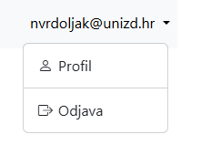
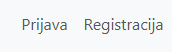

<link rel="stylesheet" href="assets/css/custom.css">

[Naslovna stranica](README.md) | [Prethodno poglavlje: Uvod u baze podataka](chapter2.md)| 


# Autentikacija

**Autentikacija** je proces identifikacije korisnika u aplikaciji kako bi im se omogućio pristup zaštićenim resursima. 
Flask nudi razne biblioteke i alate za jednostavnu implementaciju autentifikacije. 
Jedna od najpopularnijih biblioteka za to je **[Flask-Login](https://flask-login.readthedocs.io/en/latest/)**, koja omogućava rukovanje prijavom, odjavom i zaštitom ruta.

## Osnovni pojmovi
* **Prijava (Login):** Korisnik unosi svoje vjerodajnice kako bi se identificirao.
* **Odjava (Logout):** Proces prekida korisničku sesije.
* **Zaštićene rute:** Stranice kojima mogu pristupiti samo prijavljeni korisnici.

## Faktori autentikacije
* **Faktor znanja** – ono što korisnik zna – zaporka, fraza, PIN, odgovor na pitanje
* **Faktor vlasništva** – ono što korisnik ima – kartica, narukvica, telefon…
* **Faktor pripadnosti** – ono što korisnik jest ili radi – otisak prsta, mrežnica, glas, lice, potpis…
* **Faktor vremena**
* **Faktor lokacije**

Da bi se osoba pozitivno autenticirala, poželjno je da elementi barem dva faktora budu verificirani.

## Tipovi autentikacije
* Single-factor
    * Provjera autentičnosti s jednim faktorom
    * Najslabija i nepoželjna za transakcije koje traže visok nivo zaštite
* Two-factor
    * Bankomat – nešto što korisnik ima (kartica) i zna (PIN)
    * Ili zaporka (znamo) + token (imamo; na uređaju)
* Multi-factor

## Implementacije
Koristit ćemo biblioteku [Flask-Login](https://flask-login.readthedocs.io/en/latest/) za autentifikaciju, a u MongoDB bazu ćemo pohranjivati korisničke podatake.

Prvo instalirajmo flask-login, te dodatno paket *email-validator*:
```bash
pip install flask-login email-validator
```
Paket **email-validator** služi za provjeru valjanosti sintakse e-mail adrese i, opcionalno, za provjeru domena. Osigurava da korisnici unose ispravne e-mail adrese prilikom registracije ili prijave.

## Prijava

Za prijavu korisnika u našu aplikaciju koristit ćemo obrazac za prijavu, u koji će korisnik morati upisati svoju email adresu i zaporku. No prije nego nastavimo, naglasimo da zaporku nikad ne smijemo spremati u izvornom obliku. To predstavlja sigurnosni rizik zbog nekoliko razloga poput:
* **Kompromitirane baze podataka:** Ako haker dođe do baze podataka, sve zaporke će biti odmah dostupne u čitljivom obliku.
* **Ponovna upotreba zaporki:** Mnogi korisnici koriste iste zaporke na više platformi. Kompromitiranje jedne baze podataka može omogućiti pristup drugim računima korisnika.
* **Pravni i etički standardi:** Mnoge sigurnosne norme, poput GDPR-a i ISO 27001, zahtijevaju šifriranje osjetljivih podataka.
* **Povjerenje korisnika:** Gubitak povjerenja korisnika zbog curenja podataka može uništiti ugled aplikacije ili slično.

Umjesto toga, zaporke treba "heširati" (eng. hashing), što znači da se pretvaraju u nečitljiv niz znakova uz korištenje algoritma.

Flask pruža funkcije za sigurnu obradu zaporki putem biblioteke **werkzeug.security**.


### Primjer 
```python
flask shell
>>> from werkzeug.security import generate_password_hash, check_password_hash
>>> hash1 = generate_password_hash('123')
>>> print(hash1)
pbkdf2:sha256:50000$ClVWrTj0$d9ef0819c7bcd9ac996079d284f87f4969f3ba09e504c58a839a169ef10c7193
>>> check_password_hash(hash1, '123')
True
```

**generate_password_hash**
* Generira sigurnan "heš" zaporke koristeći algoritam poput PBKDF2, bcrypt ili scrypt.
* Dodaje salt (nasumični dodatak podacima) kako bi se spriječili napadi pomoću unaprijed izračunatih heševa (npr. *rainbow table attacks*).

**check_password_hash**
* Provjerava podudara li se unesena zaporka s ranije spremljenim hešom.
* Uzima unesenu zaporku, ponovo je hešira koristeći isti algoritam i uspoređuje s postojećim hešom.


### Obrazac za prijavu
Dodajmo najprije klasu za *login* obrazac u ```app.py```:


```python
from wtforms import PasswordField, BooleanField
from wtforms.validators import Email

class LoginForm(FlaskForm):
    email = StringField('E-mail', validators=[DataRequired(), Length(1, 64), Email()])
    password = PasswordField('Zaporka', validators=[DataRequired()])
    remember_me = BooleanField('Ostani prijavljen')
    submit = SubmitField('Prijava')
```

Novi elementi koje susrećemo su:
* ```Email()``` validator - Provjerava je li uneseni tekst valjana e-mail adresa
* ```PasswordField```: Specijalizirano polje za unos zaporke (prikazuje ju kao zvjezdice).
* *Ostani prijavljen*: Koristi se za opcionalnu funkcionalnost koja omogućuje korisniku da ostane prijavljen dulje vrijeme.
  * Flask-Login standardno koristi sesije za praćenje prijavljenih korisnika. Sesija traje samo dok je preglednik otvoren.
  * Ako korisnik označi opciju "Ostani prijavljen", Flask-Login stvara trajni kolačić koji pohranjuje sigurni token. Ovaj kolačić ostaje i nakon završetka sesije.

Dodajmo novu rutu:
```python
@app.route('/login', methods=['GET', 'POST'])
def login():
    form = LoginForm()
    return render_template('login.html', form = form)
```

Dodjamo i novi predložak **login.html**
```html




Prijava


<div class="container">
    <div class="page-header">
        <h1>Prijava</h1>
    </div>
    <div class="col-md-4">
        {{ render_form(form) }}
    </div>
</div>


```

Te link za prijavu u baznom predlošku:
```

{{ render_nav_item('login', 'Prijava', _use_li = True) }}

```

Pokrenimo aplikaciju, kliknimo na novi link i potvrdimo da je obrazac za prijavu prikazan. Sad slijedi implementacija prijave korisnika.

## Prijava korisnika

**Flask-login** paket s brine o prijavi, odjavi i pamćenju korisnikove sesije tijekom vremena:
* Pamti korisnički ID u sesiji i brine se o prijavi i odjavi
* Omogućava da označite koje rute može samo prijavljeni korisnik vidjeti
* Brine o implementaciji *"zapamti me"* funkcionalnosti
* Omogućava da netko ne može *ukrasti* korisničku sesiju
* Lako se integrira s drugim ekstenzijama poput *flask-principal* za autorizaciju

Ono što moramo sami napraviti je:
* Pobrinuti se gdje ćemo spremati podatke (npr. u bazu)
* Odlučiti koju metodu autentikacije ćemo koristiti (korisnik/zaporka, OpenID, i sl.)
* Brinuti o načinu registracije, aktivacije, obnovi zaporke i sl.

Dodajmo potrebne module:
```python
from flask_login import UserMixin
from flask_login import LoginManager, login_required, current_user, login_user, logout_user
```
Najprije konfigurirajmo aplikaciju da koristi flask-login:
```python
from flask_login import UserMixin, LoginManager
from flask_login import login_required, current_user, login_user, logout_user

login_manager = LoginManager()
login_manager.init_app(app)
login_manager.login_view = 'login'

@login_manager.user_loader
def load_user(user_id):
    return User.get(user_id)
```
Dodajmo ```User``` klasu koja naslijeđuje tzv. ```UserMixin``` klasu:
```python
class User(UserMixin):
    USERS = {
        'jure@unizd.hr': 'sifra1',
        'ana@unizd.hr': 'sifra2',
        'ivana@unizd.hr': 'sifra3'
    }

    def __init__(self, id):
        if not id in self.USERS:
            raise UserNotFoundError()
        self.id = id
        self.password = self.USERS[id]
         
    @classmethod
    def get(self_class, id):
        try:
            return self_class(id)
        except UserNotFoundError:
            return None

class UserNotFoundError(Exception):
    pass
```

**Objašnjenje:**

* **LoginManager** je centralni objekt u Flask-Loginu koji upravlja autentifikacijom korisnika. On omogućuje povezivanje s korisnicima, upravljanje sesijama i omogućuje funkcionalnosti poput prijave, odjave i održavanja prijave.
* ```user_loader``` je funkcija koja omogućuje Flask-Loginu da učita korisnika (iz baze podataka) na temelju ID-a spremljenog u sesiji. Ova funkcija mora biti registrirana u LoginManager i koristi se za autentifikaciju korisnika kad god dođe do novog HTTP zahtjeva.
* Ako korisnik nije prijavljen, LoginManager može automatski preusmjeriti korisnika na stranicu za prijavu (login ruta).
    * ```login_manager.login_view = 'login'``` 
* Flask-Login koristi metodu **login_user()** za prijavu korisnika.
* **logout_user()** se koristi za odjavu korisnika.
* **current_user** se koristi za pristup podacima trenutno prijavljenog korisnika u aplikaciji.
* **UserMixin** je klasa koja pruža osnovnu funkcionalnost potrebnu za rad s Flask-Loginom. Kada kreirate model korisnika, možemo naslijediti UserMixin kako bismo automatski dobili implementaciju metoda potrebnih za autentifikaciju korisnika. Metode koje UserMixin nudi:
    * **is_authenticated()**: Ova metoda vraća True ako je korisnik prijavljen, a False ako nije.
    * **is_active()**: Vraća True ako je korisnički račun aktivan (korisno za deaktivaciju korisnika), a False ako nije.
    * **is_anonymous()**: Vraća True ako je korisnik anonimni korisnik (npr. posjetitelj koji nije prijavljen), a False ako nije.
    * **get_id()**: Vraća jedinstveni identifikator korisnika (obično ID u bazi podataka), koji Flask-Login koristi za pohranu i prepoznavanje korisnika.
* U klasi **User** riječnik **USERS** je statički spremnik koji nam za sad simulira bazu podataka. Ključevi su e-mail adrese korisnika, a vrijednosti su lozinke.
* Kada se instancira objekt klase **User**, provjerava se postoji li korisnik s danim id (e-mail adresa) u rječniku USERS.
  * Ako korisnik ne postoji, baca se prilagođena iznimka UserNotFoundError.
  * Ako korisnik postoji:
    * self.id sprema korisnički ID (e-mail).
    * self.password sprema lozinku korisnika iz rječnika.
* Metoda **get()** olakšava dohvaćanje korisnika na temelju ID-a. Pokušava stvoriti instancu korisnika pozivanjem konstruktora. Ako korisnik ne postoji, vraća None umjesto da se aplikacija sruši. Korištenje ove metode olakšava upravljanje greškama pri dohvaćanju korisnika.
* Klasa **UserNotFoundError** je prilagođena iznimka koja se koristi za označavanje da korisnik nije pronađen u rječniku USERS.


U login ruti implementirajmo autentikaciju:
```python
@app.route('/login', methods=['GET', 'POST'])
def login():
    form = LoginForm()
    if form.validate_on_submit():
        user = User.get(form.email.data)
        if user is not None and user.password == form.password.data:
            login_user(user, form.remember_me.data)
            next = request.args.get('next')
            if next is None or not next.startswith('/'):
                next = url_for('index')
            flash('Uspješno ste se prijavili!', category='success')
            return redirect(next)
        flash('Neispravno korisničko ime ili zaporka!', category='warning')
    return render_template('login.html', form=form)
```

* Korisnik će biti uspješno prijavljen ako je upisao email adresu i zaportku iz riječnika USERS. Prikazuje se poruka o uspjehu i korisnik se preusmjerava na željenu ili početnu stranicu.
* Ako je korisničko ime ili zaporka neispravna, prikazuje se poruka upozorenja.
* Sigurnosna provjera **next** sigurava da korisnik ne bude preusmjeren na zlonamjerni URL.
  * Ako korisnik pokušava pristupiti zaštićenoj stranici prije prijave, parametar next će sadržavati URL te stranice.
  * Ako next nije valjan (npr. ne počinje s /), korisnik će biti preusmjeren na početnu stranicu aplikacije (index).

Dodajmo u ```index.html``` prikaz informacija o prijavljenom korisniku koje se nalaze u **current_user** objektu:
* **is_authenticated**: Provjerava je li korisnik uspješno prijavljen.
* **is_active**: Koristi se za provjeru je li korisnički račun aktivan.
* **is_anonymous**: Provjerava je li korisnik anoniman.
* **get_id()**: Dohvaća jedinstveni ID korisnika, potreban Flask-Loginu za identifikaciju korisnika unutar sesije.

```html
<div class="mt-4">
    <h4>current_user:</h4>
    <p>is_authenticated: <b>{{current_user.is_authenticated}}</b></p>
    <p>is_active: <b>{{current_user.is_active}}</b></p>
    <p>is_anonymous: <b>{{current_user.is_anonymous}}</b></p>
    <p>get_id(): <b>{{current_user.get_id()}}</b></p>
</div>
```

Također na na sve tri blog *CUD* rute dodajmo **@login_required** dekorator.
On osigurava da samo prijavljeni korisnici mogu pristupiti ovim rutama.
Ako korisnik nije prijavljen, bit će preusmjeren na stranicu za prijavu, a nakon prijave, bit će vraćen na rutu s koje je došao (ako je parametar *next* ispravno konfiguriran).

```python
@app.route('/blog/create', methods=["get", "post"])
@login_required
def post_create():
```

## Odjava
Kad je korisnik prijavljen, moramo dodati mogućnost i da se odjavi. Pa prominenimo u baznom predlošku dio s linkom za prijavu i dodajmo rutu **logout** za odjavu.

```html

    {{ render_nav_item('logout', 'Odjava', _use_li = True) }}

    {{ render_nav_item('login', 'Prijava', _use_li = True) }}

```

Ruta za odjavu:
```python
@app.route('/logout')
@login_required
def logout():
    logout_user()
    flash('Odjavili ste se.', category='success')
    return redirect(url_for('index'))
```

## Registracija
Sad ćemo dodati funkcionalnost registracije. Kreirat ćemo rutu i predložak s obrascem za registraciju. 
Kad se novi posjetitelj registrira, njegov email i zaporku ćemo spremiti u bazu, u novu kolekciju (tablicu) "Users".
Kod prijave, provjerit ćemo da li taj korisnik postoji u bazi i da li je upisao ispravnu zaporku u obrascu. 

Dodajmo klasu obrasca za registraciju. Odmah ćemo pri registaciji postaviti i da korisnik dva put upiše zaporku i da budu iste.
```python
from wtforms.validators import EqualTo

class RegisterForm(FlaskForm):
    email = StringField('E-mail', validators=[DataRequired(), Length(3, 64), Email()])
    password = PasswordField('Zaporka', validators=[DataRequired(), EqualTo('password2', message='Zaporke moraju biti jednake.')])
    password2 = PasswordField('Potvrdi zaporku', validators=[DataRequired()])
    submit = SubmitField('Registracija')
```

No prije nego je dodamo, prebacimo dio kod s klasama za obrasce. Razdvajanje koda prema funkcionalnosti poboljšava organizaciju i čitljivost koda, a i održavanje je lakše.
Stoga kreirajmo datoteku **forms.py**, te u nju prebacimo kod s klasama obrazaca:

```python
from flask_wtf import FlaskForm
from wtforms import StringField, SubmitField, FileField, TextAreaField, RadioField, DateField, FileField, PasswordField, BooleanField
from wtforms.validators import DataRequired, Length, Email, EqualTo
from flask_wtf.file import FileAllowed
from datetime import datetime

class BlogPostForm(FlaskForm):
    title = StringField('Naslov', validators=[DataRequired(), Length(min=5, max=100)])
    content = TextAreaField('Sadržaj', render_kw={"id": "markdown-editor"})
    author = StringField('Autor', validators=[DataRequired()])
    status = RadioField('Status', choices=[('draft', 'Skica'), ('published', 'Objavljeno')], default='draft')
    date = DateField('Datum', default=datetime.today)
    tags = StringField('Oznake', render_kw={"id": "tags"})
    image = FileField('Blog Image', validators=[FileAllowed(['jpg', 'png', 'jpeg'], 'Samo slike!')])
    submit = SubmitField('Spremi')

class LoginForm(FlaskForm):
    email = StringField('E-mail', validators=[DataRequired(), Length(1, 64), Email()])
    password = PasswordField('Zaporka', validators=[DataRequired()])
    remember_me = BooleanField('Ostani prijavljen')
    submit = SubmitField('Prijava')

class RegisterForm(FlaskForm):
    email = StringField('E-mail', validators=[DataRequired(), Length(3, 64), Email()])
    password = PasswordField('Zaporka', validators=[DataRequired(), Length(3, 30), EqualTo('password2', message='Zaporke moraju biti jednake.')])
    password2 = PasswordField('Potvrdi zaporku', validators=[DataRequired(), Length(3, 30)])
    submit = SubmitField('Registracija')
```

Novi **RegisterForm** obrazac sadrži dva polja za upis zaporke čime želimo osigurati da korisnik pri registraciji ispravno upiše zaporku. Dodali smo i novi validator, **EqualTo()**, koji zahtjeva da obje zaporke budu jednake.

U **app.py** pobrišimo dio s:

```
from flask_wtf import FlaskForm
from wtforms.validators import DataRequired
from flask_wtf import FlaskForm
from wtforms import StringField, SubmitField, FileField, TextAreaField, RadioField, DateField, FileField, PasswordField, BooleanField
from wtforms.validators import DataRequired, Length, Email
from flask_wtf.file import FileAllowed
```

A dodajmo:
```python
from forms import BlogPostForm, LoginForm, RegisterForm
```

Dodajmo rutu za registraciju. Ova ruta će najprije prikazati obrazac (register.html).
Ruta provjerava da li je forma ispravna (zaporka duža od 2 znaka i obje zaporke su jednake).
Zatim dohvaća iz request obkjekta vrijednost emaila i passworda.
Provjerava da li u bazi već postoji taj korisnik, te ako postoji prekida izvršavanje.
Password hashiramo (```generate_password_hash()```). Znači u bazi će uvijek biti kriptirani password.
U bazu spremamo korisnika, ispisujemo poruku, te navodimo usera da se prijavi s novim podacima.
```python
from werkzeug.security import generate_password_hash, check_password_hash

users_collection = db['users']

@app.route('/register', methods=['GET', 'POST'])
def register():
    form = RegisterForm()
    if form.validate_on_submit():
        email = request.form['email']
        password = request.form['password']
        existing_user = users_collection.find_one({"email": email})

        if existing_user:
            flash('Korisnik već postoji', category='error')
            return redirect(url_for('register'))

        hashed_password = generate_password_hash(password)
        users_collection.insert_one({
            "email": email,
            "password": hashed_password
        })
        flash('Registracija uspješna. Sad se možete prijaviti', category='success')
        return redirect(url_for('login'))

    return render_template('register.html', form=form)
```

Objašnjenje:
* ako su podaci iz obrasca ispravni, najprije ćemo provjeriti da li upisana email adresa već postoji u bazi. Ako postoji, vratit ćemo grešku.
* zaporku ćemo *heširati* pomoću **generate_password_hash** metode.
* podatke zapisujemu u bazu.

Dodajmo novi  **register.html** predložak:
```html



Registracija


<div class="container">
    <div class="page-header">
        <h1>Registracija</h1>
    </div>
    <div class="col-md-4">
        {{ render_form(form) }}
    </div>
</div>

```

Dodajmo u **base.html** i odmah ispod linka za prijavu:
```
{{ render_nav_item('register', 'Registracija', _use_li = True) }}
```

Pokrenimo aplikaciju i registrirajmo se.
* Provjerimo da ispravno radi validacija obje zaporke.
* Po uspješnoj registraciji provjerite da se u MongoDB bazi sad nalazi i kolekcija **users**.
* Vidjet ćete da je zaporka u bazi *kriptirana*.

Slijedeće što moramo napraviti jest da izmijenimo **login** rutu da provjeri da li je korisnik upisan u bazu, i da je zaporka ispravna. Provjeravamo je pomoću **check_password_hash()** metode. Zatim kreiramo instancu user objekta, te pozivamo **login_user** metodu.

```python
@app.route('/login', methods=['GET', 'POST'])
def login():
    form = LoginForm()
    if form.validate_on_submit():
        email = request.form['email']
        password = request.form['password']
        user_data = users_collection.find_one({"email": email})

        if user_data is not None and check_password_hash(user_data['password'], password):
            user = User(user_data['email'])
            login_user(user, form.remember_me.data)
            next = request.args.get('next')
            if next is None or not next.startswith('/'):
                next = url_for('index')
            flash('Uspješno ste se prijavili!', category='success')
            return redirect(next)
        flash('Neispravno korisničko ime ili zaporka!', category='warning')
    return render_template('login.html', form=form)
```

Izmijenimo i **load_user** metodu, te **User** klasu:

```python
@login_manager.user_loader
def load_user(email):
    user_data = users_collection.find_one({"email": email})
    if user_data:
        return User(user_data['email'])
    return None

class User(UserMixin):
    def __init__(self, email):
        self.id = email

    @classmethod
    def get(self_class, id):
        try:
            return self_class(id)
        except UserNotFoundError:
            return None

class UserNotFoundError(Exception):
    pass
```

Potvrdite da sve ispravno radi prijavom email adrese koju ste registrirali.

## Aktivacija korisnika i slanje emaila

Prilikom registracije, korisnik je mogao upisati bilo koju email adresu. No ipak, email adresu bi trebalo provjeriti. Provjera e-mail adrese smanjuje rizik od lažnih računa, jer korisnik mora potvrditi da je adresa valjana i u njegovom vlasništvu.
Stoga ćemo implementirati validaciju na način da ćemo poslati e-mail s linkom za potvrdu registracije.
Stoga ćemo prilikom registracije u bazui spremiti dodatno polje **is_confirmed**, poslati korisnik email s linkom za verifikaciju email adrese, i kad korisnik klikne link, naša nova ruta će ažurirati podatak u bazi da je email adresa potvrđena.

Najprije pri registraciji promijenimo da se sprema podatak **is_confirmed = False**:
```python
        users_collection.insert_one({
            "email": email,
            "password": hashed_password,
            "is_confirmed": False
        })
```

U rutu login za prijavu dodajmo:
```python
        if user_data is not None and check_password_hash(user_data['password'], password):
            if not user_data.get('is_confirmed', False):
                flash('Molimo potvrdite vašu e-mail adresu prije prijave.', category='warning')
                return redirect(url_for('login'))
```

Sad se korisnik ne može prijaviti dok ne potvrdi svoju email adresu.
Email koji ćemo poslati korisniku mora sadržavati link s verifikacijskim tokenom koji će sadržavati njegovu email adresu i vremensku oznaku, a za to ćemo koristiti Flask biblioteku **itsdangerous**.
Dodajmo stoga dvije nove metode:
```python
from itsdangerous import URLSafeTimedSerializer

def generate_confirmation_token(email):
    serializer = URLSafeTimedSerializer(app.config['SECRET_KEY'])
    return serializer.dumps(email, salt='email-confirmation-salt')

def confirm_token(token, expiration=3600):  # Token expires in 1 hour
    serializer = URLSafeTimedSerializer(app.config['SECRET_KEY'])
    try:
        email = serializer.loads(token, salt='email-confirmation-salt', max_age=expiration)
    except:
        return False
    return email
```

### Slanje maila s tokenom za verifikaciju
Za potrebe demonstacije koristit ćemo svoj GMail račun.

Za slanje email treba nam **Flask-Mail** biblioteka, pa je instalirajmo:
```bash
pip install Flask-Mail
```
Flask-Mail koristi SMTP poslužitelj za slanje e-maila. 

Koristit ćemo Gmail račun kao SMTP poslužitelj, stoga trebamo omogućiti pristup aplikacijama *trećih strana*:

* Kreiranje App Password
    * Idite na Google Account Security.
    * Pod "Signing in to Google", omogućite 2-Step Verification.
    * Nakon toga, kreirajte App Password:
        * Izaberite aplikaciju (npr. "Mail") i uređaj (npr. "Other").
        * Kopirajte generirani App Password i koristite ga umjesto vaše lozinke.

**Sigurnosne mjere**: Nikada nemojte spremati App Password direktno u kod. Umjesto toga, koristit ćemo environment variables (kasnije).

**Napomena**: Na sličan način možete koristiti i svoj Outlook račun ili neki drugi.

Dodajmo sljedeći kod za konfiguriranje i slanje emaila:
```python
from flask_mail import Mail, Message

# Konfiguracija Flask-Mail-a
app.config['MAIL_SERVER'] = 'smtp.gmail.com'
app.config['MAIL_PORT'] = 587
app.config['MAIL_USE_TLS'] = True
app.config['MAIL_USERNAME'] = 'vas.racun@gmail.com'
app.config['MAIL_PASSWORD'] = 'abcd abcd abcd abcd'   # from Google app password
app.config['MAIL_DEFAULT_SENDER'] = 'vas.racun@gmail.com'

mail = Mail(app)

def send_confirmation_email(user_email):
    token = generate_confirmation_token(user_email)
    confirm_url = url_for('confirm_email', token=token, _external=True)
    html = render_template('email_confirmation.html', confirm_url=confirm_url)
    subject = "Molimo potvrdite email adresu"
    msg = Message(subject, recipients=[user_email], html=html)
    mail.send(msg)
```

Kreirajmo i email_confirmation.html predložak:
```html
<!DOCTYPE html>
<html lang="en">
<head>
    <meta charset="UTF-8">
    <meta name="viewport" content="width=device-width, initial-scale=1.0">
    <title>Email potvrda</title>
    <style>
        /* General styles */
        body {
            font-family: Arial, sans-serif;
            background-color: #f8f9fa;
            margin: 0;
            padding: 0;
            width: 100%;
        }
        table {
            border-spacing: 0;
            border-collapse: collapse;
        }
        .container {
            max-width: 600px;
            margin: 20px auto;
            background-color: #ffffff;
            border: 1px solid #eaeaea;
            padding: 20px;
        }
        .btn-primary {
            background-color: #007bff;
            border: none;
            color: #ffffff;
            padding: 10px 20px;
            text-align: center;
            text-decoration: none;
            display: inline-block;
            font-size: 16px;
            border-radius: 5px;
        }
        .btn-primary:hover {
            background-color: #0056b3;
        }
        .footer {
            margin-top: 20px;
            text-align: center;
            font-size: 12px;
            color: #6c757d;
        }
        /* Fix for Outlook */
        img {
            border: none;
            display: block;
            outline: none;
            text-decoration: none;
        }
    </style>
</head>
<body>
    <table width="100%" bgcolor="#f8f9fa" cellpadding="0" cellspacing="0">
        <tr>
            <td>
                <!-- Start Container -->
                <table class="container" align="center" width="600" cellpadding="0" cellspacing="0">
                    <tr>
                        <td>
                            <h2 style="text-align: center; color: #333;">Potvrdite vašu email adresu</h2>
                            <p>Poštovani {{ user_email }},</p>
                            <p>Zahvaljujemo na registraciji. Da biste potvrdili svoju prijavu, molimo kliknite na slijedeći link:</p>
        
                            <!-- Button Section -->
                            <table width="100%" cellpadding="0" cellspacing="0" style="margin: 20px 0;">
                                <tr>
                                    <td align="center">
                                        <a href="{{ confirm_url }}" class="btn-primary" style="display: inline-block; padding: 10px 20px; background-color: #007bff; color: #ffffff; text-decoration: none; border-radius: 5px;">Potvrdite email adresu</a>
                                    </td>
                                </tr>
                            </table>
                            
                            <p>Ako niste kreirali ovaj račun, možete ignorirati ovaj email.</p>
        
                            <p>Srdačan pozdrav,<br>Vaš FlaskBlog.</p>
                        </td>
                    </tr>
                    <!-- Footer -->
                    <tr>
                        <td class="footer">
                            <p>&copy; {{ current_year }} FlaskBlog. Sva prava pridržana.</p>
                        </td>
                    </tr>
                </table>
                <!-- End Container -->
            </td>
        </tr>
    </table>
</body>
</html>
```

U ruti za registraciju dodajmo kod za slanje emaila:
```python
        users_collection.insert_one({
            "email": email,
            "password": hashed_password,
            "is_confirmed": False
        })
        send_confirmation_email(email)
        flash('Registracija uspješna. Da biste nastavili s radom provjerite svoj email i validirajte registaciju klikom na link u emailu.', category='success')
```

Dodajmo i rutu za potvrdu email adrese:
```python
@app.route('/confirm/<token>')
def confirm_email(token):
    try:
        email = confirm_token(token)
    except:
        flash('Link za potvrdu je neisprava ili je istekao.', 'danger')
        return redirect(url_for('unconfirmed'))

    user = users_collection.find_one({'email': email})
    if user['is_confirmed']:
        flash('Vaš račun je već potvrđen. Molimo prijavite se.', 'success')
    else:
        users_collection.update_one({'email': email}, {'$set': {'is_confirmed': True}})
        flash('Vaš račun je potvrđen. Hvala! Molimo prijavite se.', 'success')
    
    return redirect(url_for('login'))
```

### Sigurnosne mjere i environment varijable

App Password ne smijemo spremiti direktno u kod. Umjesto toga, koristit ćemo *environment variables*. Stoga ćemo osjetljive podatke poput **MAIL_SERVER, MAIL_USERNAME i MAIL_PASSWORD** spremiti u **.env** datoteku. Nju ćemo učitati korištenjem **load_dotenv()** funkcije.
Koristit ćemo **os.getenv()** za pristup varijablama. 

Kreirajmo datoteku **.env** (zamijenite email adresu i zaporku s vašom):
```
SECRET_KEY = 'nekakav komplicirani string'
MAIL_SERVER = 'smtp.gmail.com'
MAIL_PORT = 587
MAIL_USE_TLS = True
MAIL_USERNAME = 'vas.racun@gmail.com'
MAIL_PASSWORD = 'abcd abcd abcd abcd'
MAIL_DEFAULT_SENDER = 'vas.racun@gmail.com'
```

Dodajmo u **.env** u **.gitignore** datoteku, tako da ne bude prebačena u Git repozitorij:
```
/venv
/__pycache__
/.vscode
.env
```

Instalirajmo **python-dotenv**:
```bash
pip install python-dotenv
```

Dodajmo sljedeći Python kod u **app.py**:
```python
from dotenv import load_dotenv
import os

# Učitajmo varijable iz. .env datoteke prije instanciranja Flask aplikacije
load_dotenv()

app = Flask(__name__)

app.secret_key = os.getenv('SECRET_KEY')

app.config['MAIL_SERVER'] = os.getenv('MAIL_SERVER')
app.config['MAIL_PORT'] = int(os.getenv('MAIL_PORT', 587))
app.config['MAIL_USE_TLS'] = os.getenv('MAIL_USE_TLS', 'True') == 'True'
app.config['MAIL_USERNAME'] = os.getenv('MAIL_USERNAME')
app.config['MAIL_PASSWORD'] = os.getenv('MAIL_PASSWORD')
```

S ovim korakom smo završili dio s registracijom novog korisnika.

## Korisnički profil

Slijedeće što ćemo napraviti jest da korisnik može urediti svoj profil s podacima i slikom.
Najprije malo uredimo navigacijsku traku, pa izmijenimo taj dio u **base.html**:
```html
        <nav class="navbar navbar-expand-lg navbar-light bg-light mb-5">
            <a class="navbar-brand" href="{{url_for('index') }}">Flask-Blog</a>
            <button class="navbar-toggler" type="button" data-bs-toggle="collapse" data-bs-target="#navbarNav"
                aria-controls="navbarNav" aria-expanded="false" aria-label="Toggle navigation">
                <span class="navbar-toggler-icon"></span>
            </button>

            <div class="collapse navbar-collapse" id="navbarNav">
                <ul class="navbar-nav">
                    {{ render_nav_item('index', 'Početna', _use_li = True) }}
                    {{ render_nav_item('post_create', 'Novi post', _use_li = True) }}
                </ul>
                <ul class="navbar-nav ms-auto">
                    
                    <li class="nav-item dropdown">
                        <a class="nav-link dropdown-toggle" href="#" role="button" data-bs-toggle="dropdown"
                            aria-expanded="false">
                            {{current_user.get_id()}}
                        </a>
                        <ul class="dropdown-menu">
                            <li><a class="dropdown-item icon-link" href="#"><i class="bi bi-person mb-2"></i>Profil</a>
                            </li>
                            <li>
                                <hr class="dropdown-divider">
                            </li>
                            <li><a class="dropdown-item icon-link" href="{{url_for('logout') }}"><i class="bi bi-box-arrow-right mb-2"></i>Odjava</a></li>
                        </ul>
                    </li>
                    
                    {{ render_nav_item('login', 'Prijava', _use_li = True) }}
                    {{ render_nav_item('login', 'Registracija', _use_li = True) }}
                    
                    </li>
                </ul>
            </div>
        </nav>
```

Dodajmo i CDN za Bootstrap ikone u base.html:
```html
<link rel="stylesheet" href="https://cdn.jsdelivr.net/npm/bootstrap-icons@1.11.3/font/bootstrap-icons.min.css">
```

Sad ako je korisnik prijavljen, s desne strane bit će prikazano:



A ako nije prijavljen:



